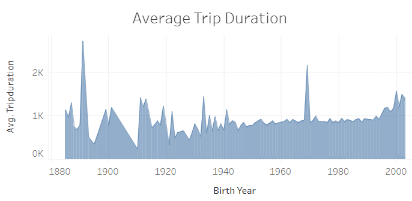
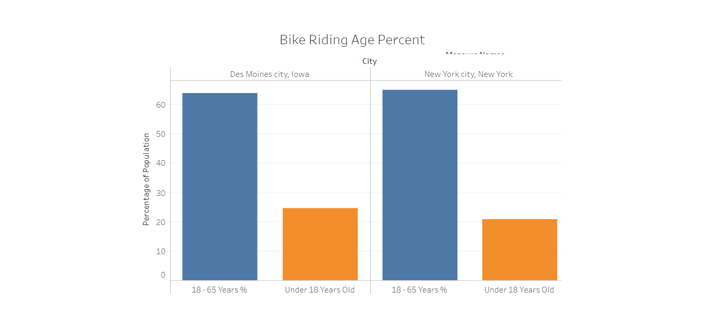
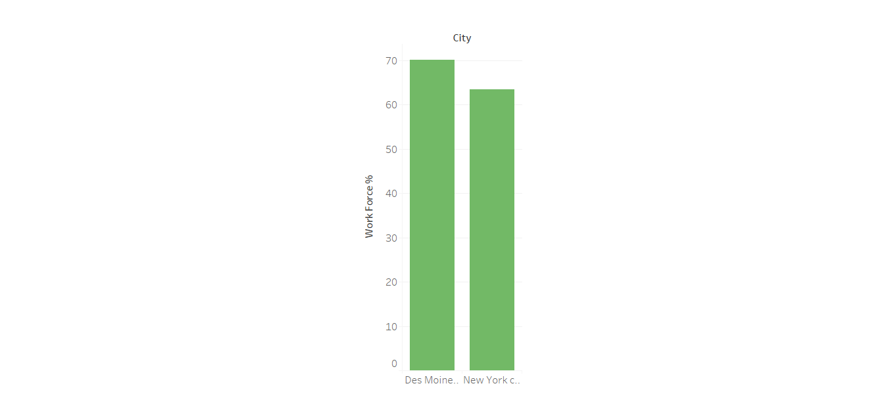
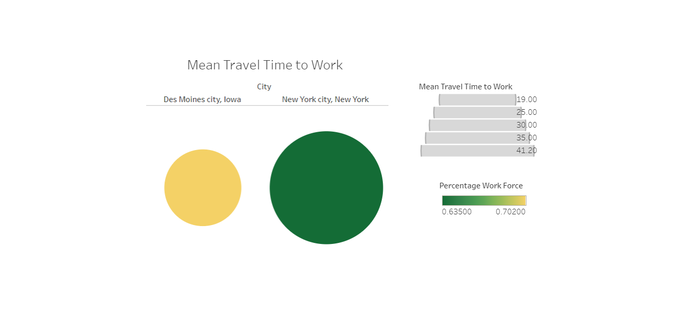
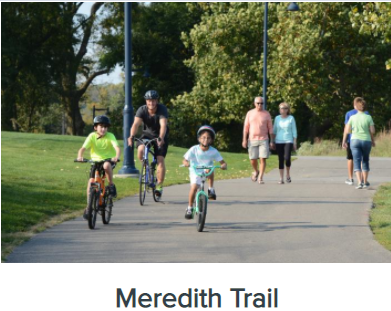

# NYC-Des Moines Citi Bike Analysis
This is a summary of the analytical work to support bike sharing business in Des Moines
## New York City
There are 2,344,224 bike riders using the bike sharing in New York City.  1.9 Million of those riders are subscribers which indicates a long term earning potential.  Majority of the bike users are between the age of 23-46 years old.

## Des Moines vs NYC
Despite the population being is significantly different between the two cities, the bike sharing business on a scaled down to the population has similar earning potential adjusted to the population.
The US Census information from July 2019 was used to make comparisons between the two cities.
Des Moines has a similar percentage of population between the age group of 18-65 years old.  However, the percentage agre group under 18 years or younger is higher than NYC.  This provides a greater opportunity to tap into a young and upcoming demographic.

Des Moines additionally has a slightly better population in the work force hence requiring alternative means of transport.

The significant factor that has a greater opportunity for bike usage is that the average commute time.  The commute time is significantly less in Des Moines than in New York City hence encouraging the population towards riding bikes to work.

Additionally, Des Moines has a lesser land mass than New York City hence reducing the requirement of commute time for recreation or work.

Des Moines had several recreational trails that are bike friendly.
* Chichaqua Valley Trail
* High Trestle Trail
* Meredith Trail
* Neal Smith Trail
* Oralabor Gateway Trail
* Walnut Creek Trail

The West Des Moines historical bike tour is an 8-mile loop featuring fun facts in unique locations.  This creates a perfect family getaway which can be fun to bike.

Further information can be obtained at
https://www.catchdesmoines.com/things-to-do/outdoor/trails/

Link to dashboard
https://public.tableau.com/profile/rahul.madarapu#!/vizhome/bikesharing_15994399892460/DesMoinesBikeSharingProject?publish=yes
